# 🛡️ Laboratorio de Servidor de Juego Multi-Tier Seguro (AWS EC2 + Docker)

[English](README.md) | **Español**

> Un laboratorio de ciberseguridad autohospedado, construido sobre una aplicación
> cliente-servidor multi-tier, desplegada y endurecida en AWS EC2. La carga de
> trabajo resulta ser un servidor de juego privado (WoW Classic 1.12.1 / VMaNGOS),
> pero el foco del proyecto es la **seguridad en la nube, el hardening de Linux, la
> orquestación de contenedores y el análisis de superficie de ataque**.

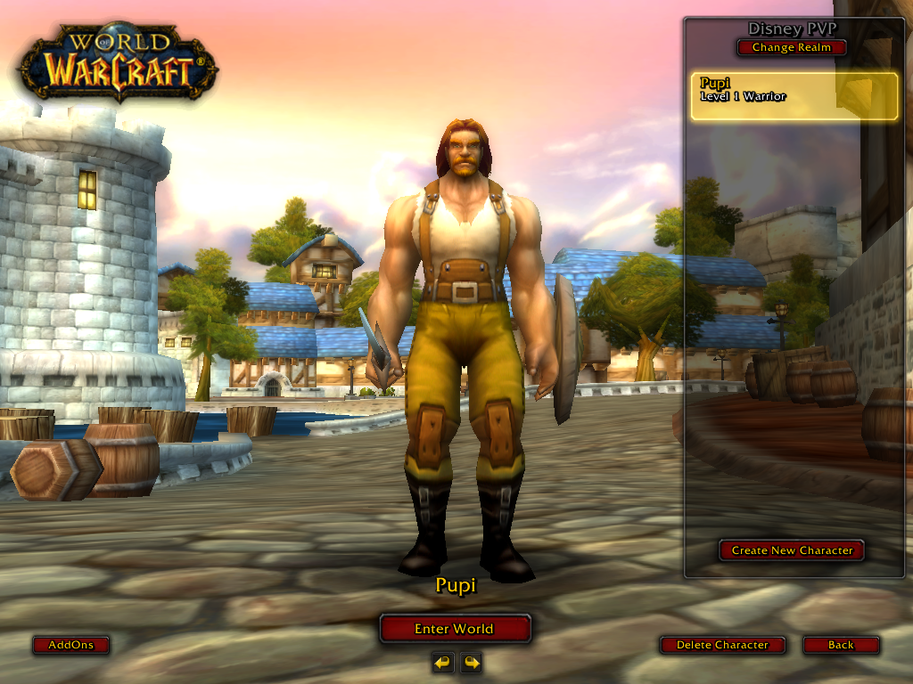
*El resultado final: un servidor desplegado, endurecido y jugable. Cliente conectado al realm en vivo.*

---

## 🎯 Objetivo

Construir una aplicación multi-tier realista en la nube y tratarla como un
ejercicio de seguridad de punta a punta: desplegarla, mapear su superficie de
ataque, endurecerla y documentar los controles y el modelo de amenazas — del mismo
modo en que evaluaría un sistema real.

Este proyecto complementa mi repo [pentest-lab](https://github.com/JoseArgento/pentest-lab):
mientras aquel se orienta a lo ofensivo, este se orienta a
**infraestructura / blue team**.

---

## 🧩 Arquitectura

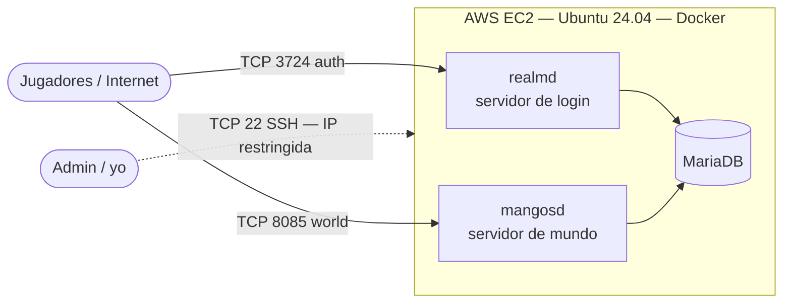

| Capa | Componente | Rol | Exposición |
|---|---|---|---|
| Auth | `realmd` | Autenticación y lista de realms | Pública (TCP 3724) |
| App | `mangosd` | Lógica del mundo del juego | Pública (TCP 8085) |
| Datos | `MariaDB` | Cuentas, personajes, datos del mundo | **Solo interna** |

---

## 🧰 Stack Tecnológico

`AWS EC2` · `Ubuntu Server 24.04 LTS` · `Docker` · `Docker Compose` ·
`MariaDB` · `ufw` · `fail2ban` · `OpenSSH`

---

## 🚀 Resumen del Despliegue

Flujo general (guía completa paso a paso: [`docs/deploy-guide.md`](./docs/deploy-guide.md)):

1. Aprovisionar una instancia EC2 (Ubuntu 24.04, `t3.medium`) con un Security Group
   acotado y una Elastic IP fija.
2. Endurecer el SO: SSH solo por clave, firewall de host (`ufw`), `fail2ban`.
3. Instalar Docker + Compose.
4. Desplegar el stack multi-tier vía Docker Compose (imágenes precompiladas).
5. Verificar el estado de los servicios y validar la conectividad.

> **Nota sobre control de costos:** la instancia se ejecuta bajo demanda (~6-8 h/día)
> y se apaga cuando está inactiva, manteniéndose dentro de los créditos del Free Tier de AWS.

**Servidor operativo** — mundo inicializado, parche de contenido y build de cliente correctos:

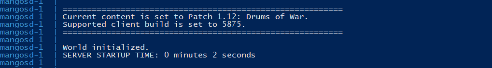

---

## 🔒 Hardening de Seguridad

El núcleo de este proyecto. Controles aplicados, mapeados a su propósito:

| Control | Implementación | Mitiga |
|---|---|---|
| **Minimización de superficie de ataque** | El Security Group expone solo 3 puertos; todo lo demás denegado por defecto | Exposición innecesaria |
| **Hardening de SSH** | Solo clave, login de root deshabilitado, password deshabilitado, acceso restringido por IP | Ataques de credenciales, acceso no autorizado |
| **Defensa en profundidad** | Firewall en la nube (Security Group) + firewall de host (`ufw`) | Falla de una sola capa |
| **Mitigación de fuerza bruta** | `fail2ban` monitoreando SSH | Ataques automatizados de login |
| **Aislamiento de base de datos** | MariaDB nunca expuesta a internet; administración solo por túnel SSH | Exfiltración de datos, ataques a la DB |
| **Validación de software no confiable** | Binarios del cliente verificados por versión, hasheados y escaneados antes de su ejecución | Riesgo de cadena de suministro / malware |

**Hardening de SSH — verificado con la config efectiva en ejecución (`sshd -T`):**

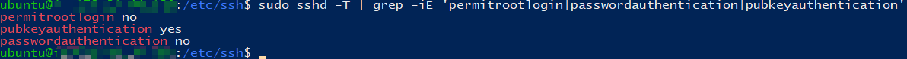

**Firewall de host (`ufw`) — default-deny, solo los 3 puertos requeridos abiertos (IPv4 + IPv6):**

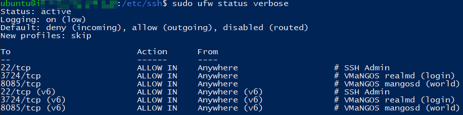

**Mitigación de fuerza bruta — jail de `fail2ban` activa sobre SSH:**

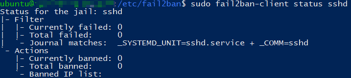

**Aislamiento de base de datos — `MariaDB` (3306) ligada solo a la red interna de Docker; nótese la ausencia de un mapeo `0.0.0.0` hacia el host, a diferencia de los puertos públicos del juego:**

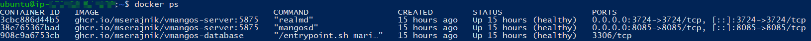

---

## 🎯 Modelo de Amenazas y Análisis de Superficie de Ataque

**Superficie expuesta:**
- TCP 3724 / 8085 — requeridos para clientes legítimos. Exposición a nivel de aplicación.
- TCP 22 — administrativo; restringido a una única IP de origen.

**Riesgos considerados y mitigaciones:**

| Riesgo | Mitigación |
|---|---|
| Fuerza bruta a SSH | Solo clave + `fail2ban` + allow-list por IP |
| Compromiso de la base de datos | Sin puerto público de DB; usuarios por defecto no alcanzables desde internet |
| Cliente de juego malicioso (cadena de suministro) | Análisis previo a la ejecución: versión, hashing, VirusTotal, análisis de comportamiento, verificación cruzada de integridad |
| Movimiento lateral | Contenedores aislados; paquetes del host minimizados |

> `[TODO: tras unos días online, agregar captura de 'fail2ban-client status sshd'
> con IPs reales baneadas — prueba del control atajando ataques reales.]`

---

## 🔍 Análisis del Cliente No Confiable (Triage de Malware)

El cliente del juego provino de una fuente no oficial, por lo que cada binario fue
sometido a triage antes de su ejecución **y** antes de distribuirlo a otros jugadores.
Reporte completo: [`evidence/binary-verification.md`](./evidence/binary-verification.md).

**Inventario completo de binarios — hashing recursivo SHA-256 de cada `.exe` / `.dll`:**

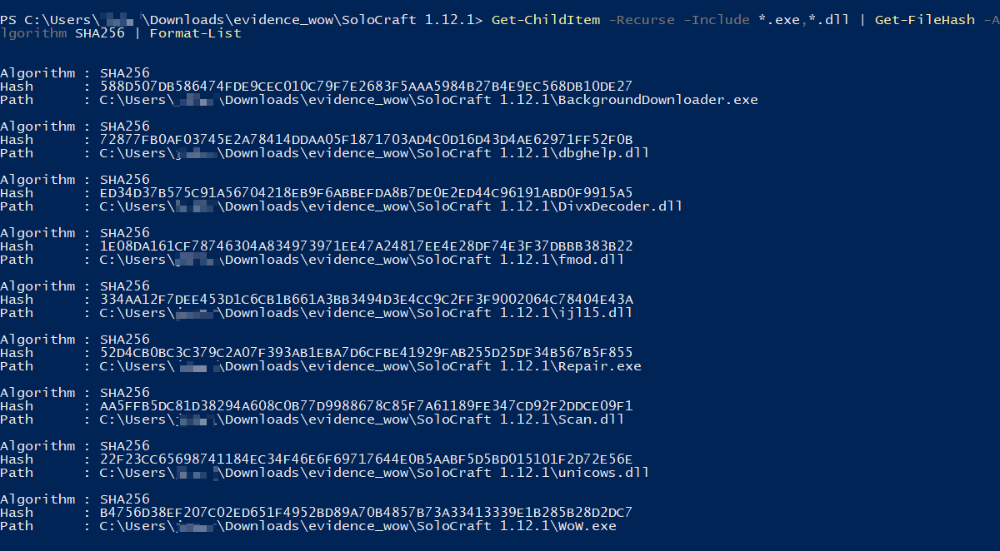

**Análisis estático en VirusTotal (muestras representativas):**

| `WoW.exe` (0/71) | `Repair.exe` (0/71) | `BackgroundDownloader.exe` (0/71) |
|---|---|---|
| 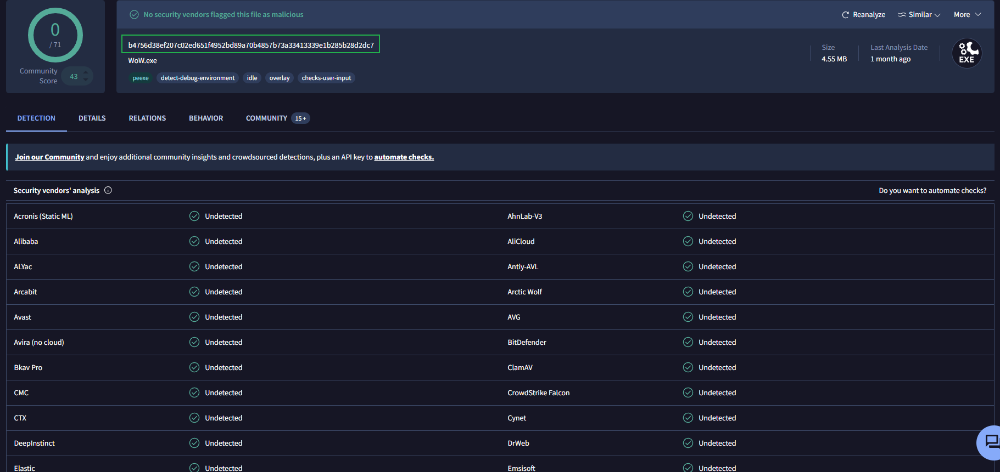 |  | 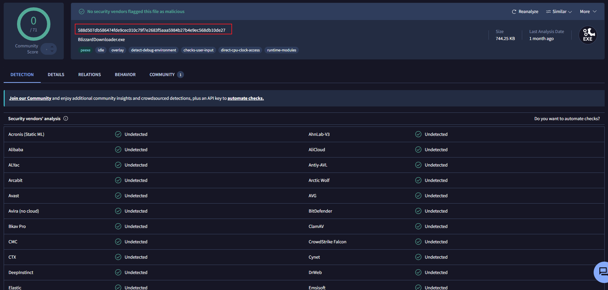 |

**El caso interesante — `Scan.dll` (2/70):** detecciones heurísticas/comportamentales
sobre un componente empaquetado con UPX. Se escaló a análisis dinámico (sin tráfico
C2, sin persistencia, sin payloads dropeados) y se resolvió como falso positivo
justificado mediante verificación cruzada de hashes.

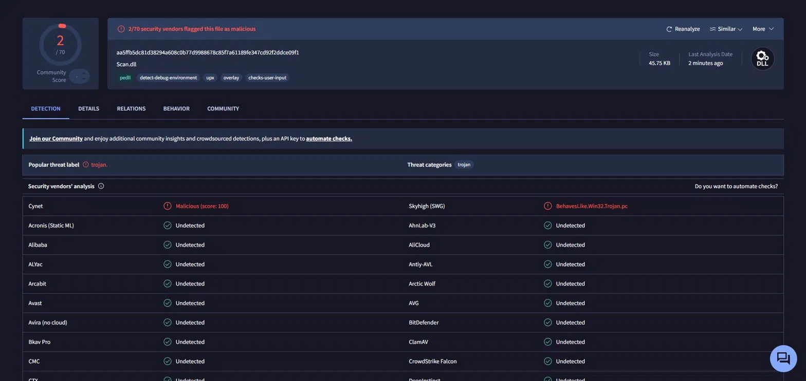

**Confirmación de versión** — build del cliente `1.12.1 (5875)`, coincidiendo con la imagen del servidor:

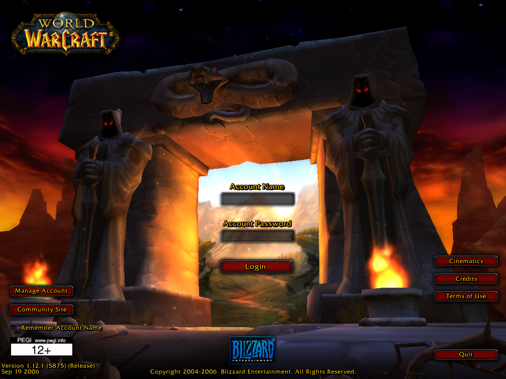

---

## 💡 Lecciones Aprendidas

Tratar un proyecto hobby como un sistema real dejó lecciones que van mucho más allá del juego:

- **Las credenciales viven en más de un lugar.** El password de la base tenía que coincidir entre el archivo de Docker Compose *y* los `.conf` de la aplicación. Un carácter `#` en el password rompía silenciosamente el parser de la cadena de conexión — un recordatorio de que el manejo de secretos falla en los huecos *entre* componentes, no dentro de ellos.
- **Verificar el estado efectivo, no el archivo de config.** Chequear `sshd -T` (la config consolidada en ejecución) en vez de confiar en un solo archivo es la diferencia entre *asumir* que un control está activo y *comprobarlo*.
- **Asignar el trabajo al recurso correcto.** Extraer los datos del cliente en local en lugar de en la instancia cloud evitó quemar créditos de CPU — una decisión de arquitectura chica con impacto real en el costo.
- **No confiar por defecto — pero tampoco rechazar por corazonada.** Las detecciones de antivirus exigieron criterio: distinguir un falso positivo heurístico de una amenaza real mediante análisis dinámico y verificación cruzada de hashes, en vez de reaccionar a una etiqueta alarmante.
- **Esto es QA, aplicado a la seguridad.** Verificar antes de confiar, mapear la superficie antes de exponerla, y comprobar que los controles funcionan es la misma mentalidad que traigo de la automatización de testing — ahora apuntada a la infraestructura.

---

## 🔭 Posibles Extensiones

- Activar el anticheat **Warden** del lado servidor y estudiar la detección de integridad del cliente desde adentro.
- Capturar y analizar el protocolo de autenticación con **Wireshark**.
- Agregar auditoría automatizada de configuración (ej. un script tipo checklist CIS).
- ✅ **Centralización de logs y detección** — ver [`docs/blue-team-logging.es.md`](./docs/blue-team-logging.es.md): pipeline Loki + Grafana + Promtail con arquitectura segura fuera del host, análisis de defensa en profundidad y validación de detección en vivo.

---

## 👤 Sobre mí

Hecho por **José** — QA Automation Engineer en transición hacia Ciberseguridad.

Este laboratorio refleja mi enfoque de la seguridad: traer una **mentalidad de testing
y validación** desde QA hacia la infraestructura y el trabajo de blue team —
verificar el software no confiable antes de confiar en él, mapear la superficie de
ataque antes de exponerla, y comprobar que los controles funcionan en lugar de asumirlo.

🔗 [ LinkedIn](https://www.linkedin.com/in/jos%C3%A9-angel-argento-victoria/) · [🔐 pentest-lab](https://github.com/JoseArgento/pentest-lab)

---

## ⚖️ Aviso

Este es un laboratorio personal, sin fines comerciales, ejecutado sobre
infraestructura privada con fines educativos en seguridad en la nube,
administración de Linux y orquestación de contenedores.

---

## 📄 Licencia

Publicado bajo la Licencia MIT. Ver [`LICENSE`](./LICENSE).
