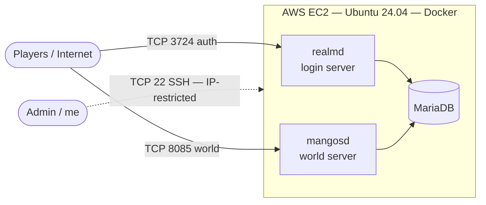
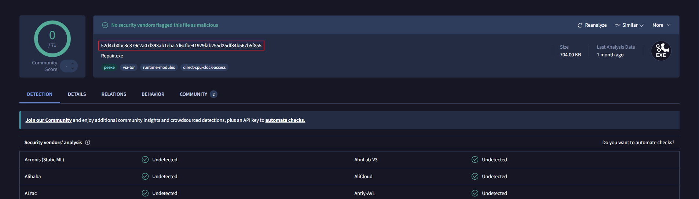

# 🛡️ Secure Multi-Tier Game Server Lab (AWS EC2 + Docker)

**English** | [Español](README.es.md)

> A self-hosted cybersecurity lab built around a multi-tier client-server
> application, deployed and hardened on AWS EC2. The workload happens to be a
> private game server (WoW Classic 1.12.1 / VMaNGOS) — but the focus of this
> project is **cloud security, Linux hardening, container orchestration and
> attack-surface analysis**.

*The end result: a fully deployed, hardened and playable server. Client connected to the live realm.*

---

## 🎯 Objective

Build a realistic, multi-tier application in the cloud and treat it as a
security exercise end-to-end: deploy it, map its attack surface, harden it, and
document the controls and threat model — the same way I'd assess a real system.

This complements my [pentest-lab](https://github.com/JoseArgento/pentest-lab) repo: where
that project leans offensive, this one leans **infrastructure / blue team**.

---

## 🧩 Architecture

| Tier | Component | Role | Exposure |
|---|---|---|---|
| Auth | `realmd` | Authentication & realm list | Public (TCP 3724) |
| App | `mangosd` | Game-world logic | Public (TCP 8085) |
| Data | `MariaDB` | Accounts, characters, world data | **Internal only** |

---

## 🧰 Tech Stack

`AWS EC2` · `Ubuntu Server 24.04 LTS` · `Docker` · `Docker Compose` ·
`MariaDB` · `ufw` · `fail2ban` · `OpenSSH`

---

## 🚀 Deployment Overview

High-level flow (full step-by-step guide: [`docs/deploy-guide.md`](./docs/deploy-guide.md)):

1. Provision an EC2 instance (Ubuntu 24.04, `t3.medium`) with a tightly-scoped
   Security Group and a static Elastic IP.
2. Harden the OS: key-only SSH, host firewall (`ufw`), `fail2ban`.
3. Install Docker + Compose.
4. Deploy the multi-tier stack via Docker Compose (prebuilt images).
5. Verify service health and validate connectivity.

> **Note on cost control:** the instance is run on-demand (~6–8 h/day) and
> stopped when idle, keeping it within AWS Free Tier credits.

**Server up and running** — world initialized, correct content patch and client build loaded:

---

## 🔒 Security Hardening

The core of this project. Controls applied, mapped to their purpose:

| Control | Implementation | Mitigates |
|---|---|---|
| **Attack surface minimization** | Security Group exposes only 3 ports; all else denied by default | Unnecessary exposure |
| **SSH hardening** | Key-only auth, root login disabled, password auth disabled, access IP-restricted | Credential attacks, unauthorized access |
| **Defense in depth** | Cloud firewall (Security Group) + host firewall (`ufw`) | Single-layer failure |
| **Brute-force mitigation** | `fail2ban` monitoring SSH | Automated login attacks |
| **Database isolation** | MariaDB never exposed to the internet; admin only via SSH tunnel | Data exfiltration, DB attacks |
| **Untrusted-software validation** | Client binaries version-checked, hashed and scanned before execution | Supply-chain / malware risk |

**SSH hardening — verified with the effective running config (`sshd -T`):**

**Host firewall (`ufw`) — default-deny, only the 3 required ports open (IPv4 + IPv6):**

**Brute-force mitigation — `fail2ban` jail active on SSH:**

**Database isolation — `MariaDB` (3306) bound to the internal Docker network only; note the absence of a `0.0.0.0` host mapping, unlike the public game ports:**

---

## 🎯 Threat Model & Attack Surface Analysis

**Exposed surface:**
- TCP 3724 / 8085 — required for legitimate clients. Application-layer exposure.
- TCP 22 — administrative; restricted to a single source IP.

**Key risks considered & mitigations:**

| Risk | Mitigation |
|---|---|
| SSH brute force | Key-only auth + `fail2ban` + IP allow-listing |
| Database compromise | No public DB port; default DB users not internet-reachable |
| Malicious game client (supply chain) | Pre-execution analysis: version check, hashing, VirusTotal, behavior analysis, cross-source integrity check |
| Lateral movement | Containers isolated; minimal host packages |

> `[TODO: after a few days online, add a 'fail2ban-client status sshd' capture
> with real banned IPs — proof of the control stopping actual attacks.]`

---

## 🔍 Untrusted Client Analysis (Malware Triage)

The game client came from an unofficial source, so every binary was triaged
before execution **and** before distributing it to other players. Full report:
[`evidence/binary-verification.md`](./evidence/binary-verification.md).

**Complete binary inventory — recursive SHA-256 hashing of every `.exe` / `.dll`:**

**Static analysis on VirusTotal (representative samples):**

| `WoW.exe` (0/71) | `Repair.exe` (0/71) | `BackgroundDownloader.exe` (0/71) |
|---|---|---|
|  |  |  |

**The interesting case — `Scan.dll` (2/70):** heuristic/behavioral detections on a
UPX-packed component. Escalated to dynamic analysis (no C2 traffic, no
persistence, no dropped payloads) and resolved as a justified false positive via
cross-source hash verification.

**Version confirmation** — client build `1.12.1 (5875)`, matching the server image:

---

## 💡 Lessons Learned

Treating a hobby project as a real system surfaced lessons that go well beyond gaming:

- **Credentials live in more than one place.** The database password had to match across the Docker Compose file *and* the application's `.conf` files. A `#` character in the password silently broke the connection-string parser — a reminder that secret management fails in the gaps between components, not within them.
- **Verify the effective state, not the config file.** Checking `sshd -T` (the consolidated running config) rather than trusting a single file is the difference between *assuming* a control is active and *proving* it is.
- **Match the work to the resource.** Extracting client data locally instead of on the cloud instance avoided burning CPU credits — a small architectural decision with a real cost impact.
- **Don't trust by default — and don't reject by feeling either.** Antivirus detections required judgment: distinguishing a heuristic false positive from a real threat through dynamic analysis and cross-source hash verification, rather than reacting to a scary label.
- **This is QA, applied to security.** Verifying before trusting, mapping the surface before exposing it, and proving controls work is the same mindset I bring from test automation — now pointed at infrastructure.

---

## 🔭 Possible Extensions

- Enable server-side **Warden** anticheat and study client-integrity detection from the inside.
- Capture and analyze the authentication protocol with **Wireshark**.
- Add automated configuration auditing (e.g., a CIS-style checklist script).
- ✅ **Centralized logging & detection** — see [`docs/blue-team-logging.md`](./docs/blue-team-logging.md): a Loki + Grafana + Promtail pipeline with secure off-host architecture, defense-in-depth analysis and live detection validation.

---

## 👤 About

Built by **José** — QA Automation Engineer transitioning into Cybersecurity.

This lab reflects my approach to security: bringing a **testing and validation
mindset** from QA into infrastructure and blue-team work — verifying untrusted
software before trusting it, mapping attack surface before exposing it, and
proving controls work rather than assuming they do.

🔗 [ LinkedIn](https://www.linkedin.com/in/jos%C3%A9-angel-argento-victoria/) · [🔐 pentest-lab](https://github.com/JoseArgento/pentest-lab)

---

## ⚖️ Disclaimer

This is a personal, non-commercial lab run on private infrastructure for
educational purposes in cloud security, Linux administration and container
orchestration.

---

## 📄 License

Released under the MIT License. See [`LICENSE`](./LICENSE).
