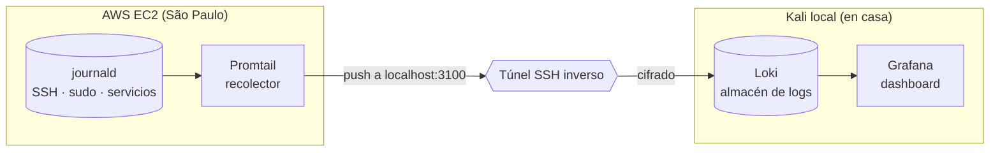

# 📊 Laboratorio de Centralización de Logs y Detección (Blue Team)

[English](blue-team-logging.md) | **Español**

> Extensión Blue Team del lab de servidor de juego: un pipeline de centralización
> de logs (estilo SIEM liviano) que recolecta los eventos del servidor en AWS EC2 y
> los envía, de forma segura, a un stack de observabilidad fuera del host monitoreado.

---

## 🎯 Objetivo

Dar visibilidad y capacidad de detección sobre el servidor: centralizar los logs del
sistema (SSH, sudo, servicios, fail2ban) en un único punto consultable, aplicando
buenas prácticas de seguridad en el propio diseño del pipeline.

---

## 🧩 Arquitectura



| Componente | Rol | Ubicación |
|---|---|---|
| **Promtail** | Recolecta del journald y envía a Loki | EC2 (host monitoreado) |
| **Loki** | Almacena e indexa los logs por etiquetas | Kali (fuera del host) |
| **Grafana** | Dashboard y consultas | Kali |

---

## 🔐 Decisiones de seguridad en el diseño

El pipeline no solo centraliza: está diseñado con criterio Blue Team de punta a punta.

1. **Los logs viven FUERA del host monitoreado.** Si un atacante compromete la EC2,
   lo primero que intenta es borrar logs para tapar huellas. Al almacenarlos en una
   máquina separada (Kali), se preserva la integridad y disponibilidad de la
   evidencia aunque el host caiga.
2. **Túnel SSH inverso, sin abrir puertos nuevos.** Promtail envía a `localhost:3100`,
   que es la boca de un túnel SSH inverso (`ssh -R`) iniciado desde la Kali. No se
   agregó ninguna regla al Security Group de la EC2: la superficie de ataque no creció.
3. **Tráfico de logs cifrado.** Al viajar dentro del túnel SSH, los logs van cifrados
   en tránsito.
4. **Loki y Grafana atados a `127.0.0.1`.** No se exponen ni en la red local; Grafana
   se accede desde el navegador de la propia Kali.
5. **Promtail con acceso de solo lectura** al journald del host (bind mounts `:ro`):
   principio de mínimo privilegio aplicado al contenedor recolector.

---

## 🔎 Hallazgo: defensa en profundidad (el silencio que dice mucho)

Tras varios días con el servidor online, el jail de `fail2ban` reportaba:

```
Total failed:  0
Total banned:  0
Banned IP list: (vacío)
```

**Cero intentos fallidos no significa ausencia de atacantes — significa que un control
de capa superior los está filtrando antes.** El puerto SSH (22) está restringido en el
Security Group de AWS a una única IP de origen. El tráfico hostil de los bots de
internet es descartado en la **capa de red**, antes de alcanzar el host, por lo que
`fail2ban` (control de **capa de host**) nunca tiene nada que banear.

> **Lectura Blue Team:** el control perimetral (Security Group) absorbe el ataque tan
> arriba que el control de host (fail2ban) resulta innecesario. Es defensa en
> profundidad funcionando: el valor de fail2ban aquí no es la cantidad de baneos, sino
> ser una segunda capa lista por si la primera fallara o cambiara la regla de origen.

---

## 🧪 Validación de la detección (demo controlada)

Para verificar que la cadena de detección funciona de extremo a extremo, se generaron
intentos de autenticación fallidos **controlados** desde una IP autorizada (sin
exponer SSH al mundo). Los eventos fueron visibles en Grafana en tiempo real,
confirmando el flujo:

```
journald (EC2) → Promtail → túnel SSH → Loki → Grafana ✅
```

**Eventos de login fallido detectados en tiempo real:**


Al superar el umbral (5 intentos en 10 minutos), `fail2ban` ejecutó la respuesta
automática y baneó la IP de origen:


### Dashboard de monitoreo de autenticación

Se construyó un dashboard en Grafana con paneles de intentos fallidos (total e
histórico), eventos por servicio (top-N), logins exitosos y actividad SSH reciente,
con auto-refresh — al estilo de un panel de SOC. *(Datos sensibles sanitizados.)*


### Consultas LogQL de ejemplo

```logql
# Todos los eventos del sistema
{job="systemd-journal"}

# Solo SSH
{job="systemd-journal", unit="ssh.service"}

# Intentos fallidos / usuarios inválidos
{job="systemd-journal"} |~ "Invalid user|Failed password|Permission denied"

# Conteo de fallidos en el tiempo (para gráficos)
sum(count_over_time({job="systemd-journal"} |~ "Invalid user|Failed password" [$__interval]))

# Top servicios por volumen de eventos
topk(8, sum by (unit) (count_over_time({job="systemd-journal"} [$__range])))
```

---

## 🧠 Skills demostradas

- Diseño y despliegue de un pipeline de centralización de logs (SIEM liviano)
- Arquitectura segura: separación de logs del host, cifrado en tránsito, mínima superficie
- Túnel SSH inverso para telemetría sin exponer puertos
- Consultas de logs y threat hunting con LogQL / Grafana
- Construcción de dashboards de monitoreo de seguridad
- Validación de la cadena detección → respuesta automática
- Interpretación de evidencia: comprender qué dice (y qué NO dice) la ausencia de eventos
- Razonamiento de defensa en profundidad e interacción entre capas de control

---

*Parte del lab de ciberseguridad — extensión Blue Team de detección y observabilidad.*
