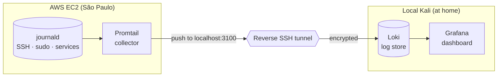
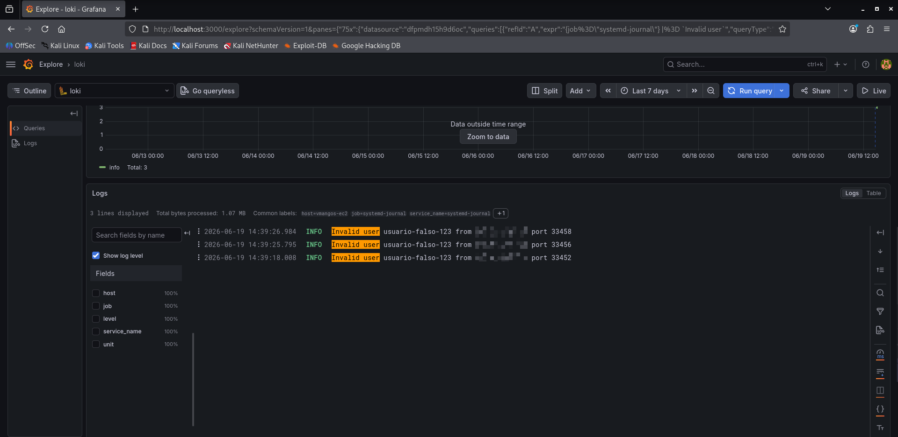
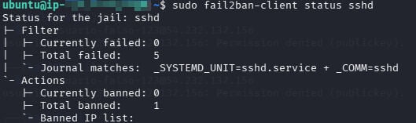
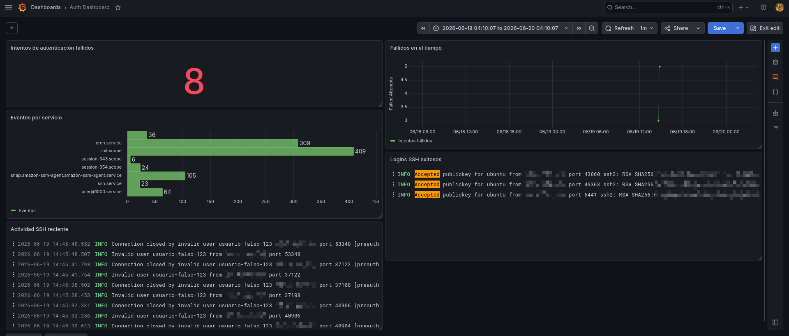

# 📊 Centralized Logging & Detection Lab (Blue Team)

**English** | [Español](blue-team-logging.es.md)

> Blue-team extension of the game-server lab: a log centralization pipeline (a
> lightweight SIEM) that collects events from the AWS EC2 server and securely ships
> them to an observability stack living off the monitored host.

---

## 🎯 Objective

Gain visibility and detection capability over the server: centralize system logs
(SSH, sudo, services, fail2ban) in a single queryable place, applying security best
practices in the design of the pipeline itself.

---

## 🧩 Architecture



| Component | Role | Location |
|---|---|---|
| **Promtail** | Collects from journald and ships to Loki | EC2 (monitored host) |
| **Loki** | Stores and indexes logs by labels | Kali (off-host) |
| **Grafana** | Dashboards and queries | Kali |

---

## 🔐 Security decisions in the design

The pipeline doesn't just centralize — it's designed with blue-team judgment end to end.

1. **Logs live OFF the monitored host.** If an attacker compromises the EC2 instance,
   their first move is to wipe logs to cover their tracks. Storing them on a separate
   machine (Kali) preserves the integrity and availability of the evidence even if the
   host falls.
2. **Reverse SSH tunnel, no new ports opened.** Promtail ships to `localhost:3100`, the
   mouth of a reverse SSH tunnel (`ssh -R`) initiated from Kali. No rule was added to
   the EC2 Security Group: the attack surface did not grow.
3. **Encrypted log traffic.** Traveling inside the SSH tunnel, logs are encrypted in transit.
4. **Loki and Grafana bound to `127.0.0.1`.** Not exposed even on the local network;
   Grafana is accessed from Kali's own browser.
5. **Promtail with read-only access** to the host's journald (`:ro` bind mounts):
   least privilege applied to the collector container.

---

## 🔎 Finding: defense in depth (the silence that says a lot)

After several days with the server online, the `fail2ban` jail reported:

```
Total failed:  0
Total banned:  0
Banned IP list: (empty)
```

**Zero failed attempts doesn't mean no attackers — it means an upper-layer control is
filtering them first.** The SSH port (22) is restricted in the AWS Security Group to a
single source IP. Hostile traffic from internet bots is dropped at the **network
layer**, before reaching the host, so `fail2ban` (a **host-layer** control) never has
anything to ban.

> **Blue-team reading:** the perimeter control (Security Group) absorbs the attack so
> high up that the host control (fail2ban) becomes unnecessary. This is defense in
> depth working: fail2ban's value here isn't the number of bans, but being a second
> layer ready in case the first one failed or the source rule changed.

---

## 🧪 Detection validation (controlled demo)

To verify the detection chain works end to end, **controlled** failed authentication
attempts were generated from an authorized IP (without exposing SSH to the world). The
events were visible in Grafana in real time, confirming the flow:

```
journald (EC2) → Promtail → SSH tunnel → Loki → Grafana ✅
```

**Failed login events detected in real time:**



After crossing the threshold (5 attempts in 10 minutes), `fail2ban` executed the
automatic response and banned the source IP:



### Authentication monitoring dashboard

A Grafana dashboard was built with panels for failed attempts (total and over time),
events per service (top-N), successful logins and recent SSH activity, with
auto-refresh — SOC-panel style. *(Sensitive data sanitized.)*



### Example LogQL queries

```logql
# All system events
{job="systemd-journal"}

# SSH only
{job="systemd-journal", unit="ssh.service"}

# Failed attempts / invalid users
{job="systemd-journal"} |~ "Invalid user|Failed password|Permission denied"

# Count of failures over time (for graphs)
sum(count_over_time({job="systemd-journal"} |~ "Invalid user|Failed password" [$__interval]))

# Top services by event volume
topk(8, sum by (unit) (count_over_time({job="systemd-journal"} [$__range])))
```

---

## 🧠 Skills demonstrated

- Design and deployment of a log centralization pipeline (lightweight SIEM)
- Secure architecture: logs off-host, encrypted in transit, minimal surface
- Reverse SSH tunnel for telemetry without exposing ports
- Log querying and threat hunting with LogQL / Grafana
- Building security monitoring dashboards
- Validation of the detection → automatic response chain
- Evidence interpretation: understanding what the absence of events does (and doesn't) mean
- Defense-in-depth reasoning and interaction between control layers

---

*Part of the cybersecurity lab — blue-team detection and observability extension.*
