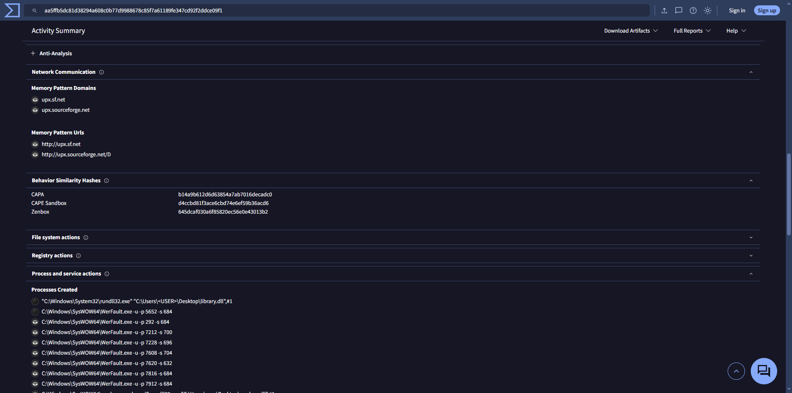

# 🔍 Binary Verification — WoW 1.12.1 Client

**English** | [Español](binary-verification.es.md)

> **Full attack-surface analysis of an untrusted client before using it in the lab.**
>
> The WoW 1.12.1 client is not distributed through official channels; the copies in
> circulation come from the community and constitute software of unverified origin.
> Before executing it — and before distributing it to other users — a complete
> security triage was performed on all of its binaries.

---

## 🎯 Methodology

The analysis followed a four-stage diligence chain, escalating depth only where the
evidence justified it:

1. **Inventory & hashing** — SHA-256 of **every** executable and library
   (`.exe`, `.dll`) in the client.
2. **Static analysis** — verification of each hash against VirusTotal.
3. **Dynamic analysis** — for binaries with detections, review of sandbox behavior
   (network, persistence, processes, files).
4. **Cross-verification** — comparison of hashes against a second 1.12.1 client from
   an independent source to confirm integrity (original vs. modified).

### Hashing command

```powershell
Get-ChildItem -Recurse -Include *.exe,*.dll | Get-FileHash -Algorithm SHA256 | Format-List
```


---

## 📊 Stage 1-2: Inventory & static analysis (SoloCraft 1.12.1 client)

| # | File | Type | SHA-256 | VirusTotal | Result |
|---|---|---|---|---|---|
| 1 | `WoW.exe` | Main executable | `B4756D38…B28D2DC7` | 0/71 | ✅ Clean |
| 2 | `BackgroundDownloader.exe` | Downloader (Blizzard) | `588D507D…DB10DE27` | 0/71 | ✅ Clean |
| 3 | `Repair.exe` | Repair tool (Blizzard) | `52D4CB0B…567B5F855` | 0/71 | ✅ Clean |
| 4 | `dbghelp.dll` | Debug helper (common hijacking target) | `72877FB0…52F0B` | 0/71 | ✅ Clean |
| 5 | `DivxDecoder.dll` | Cinematics codec | `ED34D37B…9915A5` | 1/71 | ⚠️ False positive |
| 6 | `fmod.dll` | Audio engine | `1E08DA16…383B22` | 1/70 | ⚠️ False positive |
| 7 | `ijl15.dll` | Intel JPEG Library | `334AA12F…404E43A` | 0/70 | ✅ Clean |
| 8 | `Scan.dll` | Repack component (scanner) | `AA5FFB5D…CE09F1` | 2/70 | ⚠️ False positive (escalated) |
| 9 | `unicows.dll` | Unicode layer (legacy) | `22F23CC6…D72E56E` | 0/71 | ✅ Clean |

### Interpreting the detections

The 3 detections follow an internally consistent pattern that points to
**heuristic false positives**, not malware:

- **`DivxDecoder.dll` (1/71)** and **`fmod.dll` (1/70)**: only **Cynet**, with the
  generic Machine Learning label *"Malicious (score: 100)"*. No malware family
  identified. Both are legacy audio/video components (2004-2006) that trip ML models
  due to their low-level memory access.
- **`Scan.dll` (2/70)**: Cynet (generic ML) + Skyhigh (`BehavesLike.Win32.Trojan`, a
  **behavioral** detection, not signature-based). UPX-packed. Required dynamic
  analysis (see Stage 3).

> **Applied judgment:** an isolated heuristic detection, with no named malware
> family, on a known legacy binary, with most reference engines (Microsoft,
> Kaspersky, BitDefender, ESET, CrowdStrike) reporting clean, is classified as a
> justified false positive.

---

## 🔬 Stage 3: Dynamic analysis of `Scan.dll`

As the binary with the most detections and "trojan-like" behavior, both its
detection and its sandbox execution were reviewed.


| Vector observed | Finding | Reading |
|---|---|---|
| **Network (C2)** | Only `upx.sf.net` / `upx.sourceforge.net` strings | UPX packer signature in memory — **not C2 connections**. Zero suspicious outbound traffic. |
| **Persistence** | No autostart keys (`Run`, services) | Only Windows telemetry/compatibility keys. |
| **Processes** | `rundll32`, `WerFault.exe`, dumps under `…\WER\…` | Sandbox scaffolding + DLL crash when run out of context. Not binary activity. |
| **Payloads** | No new executables dropped | Only Windows Error Reporting artifacts. |



**Dynamic analysis conclusion:** no C2 network, no persistence, no payloads.
Behavior consistent with a UPX-packed scanner/anti-cheat module that trips
behavioral heuristics, **not with active malware**.

---

## 🔗 Stage 4: Cross-verification (RetroWoW 1.12.1 client)

To confirm the binaries are **original and unmodified**, the hashes were compared
against a second 1.12.1 client from a fully independent source (RetroWoW).

| File | SoloCraft | RetroWoW | Identical? |
|---|---|---|---|
| `WoW.exe` | `B4756D38…` | `B4756D38…` | ✅ Yes |
| `dbghelp.dll` | `72877FB0…` | `72877FB0…` | ✅ Yes |
| `DivxDecoder.dll` | `ED34D37B…` | `ED34D37B…` | ✅ Yes |
| `fmod.dll` | `1E08DA16…` | `1E08DA16…` | ✅ Yes |
| `ijl15.dll` | `334AA12F…` | `334AA12F…` | ✅ Yes |
| `Repair.exe` | `52D4CB0B…` | `52D4CB0B…` | ✅ Yes |
| `unicows.dll` | `22F23CC6…` | `22F23CC6…` | ✅ Yes |
| `Scan.dll` | `AA5FFB5D…` | `4D83FD76…` | ❌ **Different** |

**Key finding:** the 7 core Blizzard components have **identical** SHA-256 hashes
across two independent repacks. This is cryptographic proof that they are the
original, unmodified Blizzard binaries — had any been trojanized in one copy, its
hash would differ from the other source.

The only divergent file, `Scan.dll`, **is not a Blizzard component** but specific to
each repack, which explains why it doesn't match.

### Note on `WowError.exe` (RetroWoW-only)

The RetroWoW client also includes `WowError.exe` (`2A3FD716…`), absent in SoloCraft.
Detection: **1/67 (MaxSecure: `Trojan.Malware.300983.susgen`)**. The `.susgen`
suffix = *suspicious generic*, MaxSecure is a low-reputation engine, and the binary
is **Armadillo**-packed. It is WoW's legitimate crash handler; the detection is a
packing-driven false positive. Not used in the deployment.

---

## ✅ Conclusion & deployment decision

The **7 core Blizzard components** were verified as original and unmodified
(identical hashes across two independent sources), with clean static analysis or
justified heuristic false positives.

Two accessory components showed isolated heuristic detections (`Scan.dll` 2/70,
`WowError.exe` 1/67), both packed (UPX / Armadillo) and with no identified malware
family. Dynamic analysis of `Scan.dll` revealed no malicious behavior.

**Decision:** the SoloCraft 1.12.1 client is used as the base, **excluding
`Scan.dll`** from the deployment directory. That component is not required to
connect to the VMaNGOS server, so excluding it removes the only surface that could
not be verified against an original binary — minimizing residual risk without
affecting functionality.

---

## 🖼️ Version verification

Confirmed client build: **1.12.1 (5875)**, matching the server image
(`vmangos-server:5875`).


---

## 🧠 Skills demonstrated

- Structured malware triage (static → dynamic → integrity verification)
- Critical interpretation of antivirus results (false positives vs. real threats)
- Sandbox behavior analysis
- Cryptographic hash integrity verification
- Evidence-based security decision-making (reduction of unverifiable surface)

---

*Part of the cybersecurity lab — validation of untrusted software prior to execution and distribution.*
